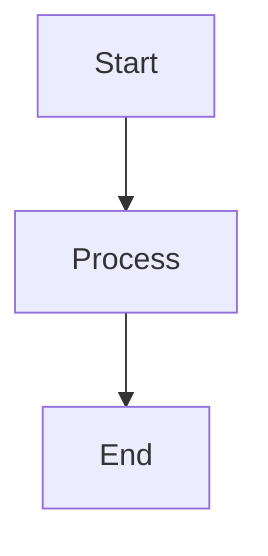

# My Kanban - Claude Reference

## Project Overview
Local, file-based Kanban board with Notion-style pages. Data stored as **single markdown files** (not folders) with YAML frontmatter.

**Tech Stack:** React 18 + TypeScript + Vite + Tauri v2 + Zustand

## Architecture (NEW - File-Based)
- **Dual Platform:** PWA (browser) + Tauri desktop app
- **Storage:** Browser File System Access API / Tauri FS plugin (runtime-selected via `fileSystemFactory.ts`)
- **Data Model:** Everything is a Page (`src/types/page.ts`)
- **File Structure:** One `.md` file per page (not `folder/index.md`)
- **Images:** Centralized in `workspace/.images/` with content-addressed storage
- **Page Hierarchy:** `parentId` field (not file system structure)
- **State:** Zustand store (`src/store/useStore.ts`)

## Key Directories
```
src/
├── components/    # UI components (Layout, PageEditor, Sidebar, modals)
├── services/      # Business logic (fileSystem, markdown, page, image, config, migration, link)
├── pages/         # Route pages (Home, PageView, Settings)
├── lib/           # Utilities (slash-commands, openExternal)
├── hooks/         # Custom hooks (useMarkdownShortcuts, useMermaid)
├── store/         # Zustand state
└── types/         # TypeScript interfaces (page, link, filter, config, fileSystem)
```

## Data Structure (NEW)
```
workspace/
├── .images/           # Centralized image storage (SHA-256 content hashing)
│   ├── abc123.png
│   └── def456.png
├── Project A.md       # Root-level page
├── Task 1.md          # Child page (has parentId → Project A)
├── Task 2.md          # Child page (has parentId → Project A)
└── Notes.md           # Root-level page
```

**Page Format:**
```yaml
---
id: "uuid"                     # Required: unique identifier
title: "Page Title"            # Required: display name
parentId: "parent-page-id"     # Optional: for nested pages (creates parent-child relationship)
kanbanColumn: "To Do"          # Optional: column assignment for kanban board
tags: ["work", "urgent"]       # Optional: array of tags for filtering
dueDate: "2026-03-01"          # Optional: ISO date string
createdAt: "2026-02-21T10:00Z" # Auto: creation timestamp
updatedAt: "2026-02-21T15:30Z" # Auto: last modification timestamp
viewType: "document"           # document | kanban (future: calendar, etc.)
pinned: false                  # Optional: pin to top of column
pinnedAt: "2026-02-21T15:30Z"  # Optional: when pinned
---

# Page Content

Link to other pages: [[Page Title]] or [[page-id|Display Text]]
Images: 
Code blocks with syntax highlighting
- [ ] Interactive checkboxes
- [x] Completed items


```

## Development

### Workflow
- Main branch: `main`
- Feature branch: `refactor/single-file-structure`
- Tests: Vitest + Testing Library
- Commands: `npm run dev`, `npm run tauri:dev`, `npm test`
- Never modify git history or force push to main

### Code Style & Conventions
- TypeScript strict mode enabled
- Functional components with hooks (no class components)
- CSS modules avoided - use scoped CSS files per component
- Color values: Use CSS variables from `global.css` (e.g., `var(--accent-primary)`)
- State management: Zustand for global state, useState for local component state
- File naming: PascalCase for components, camelCase for utilities
- Imports: Absolute imports using `@/` alias

### Architecture Principles
- **Service layer separation**: All file I/O through services (pageService, imageService, etc.)
- **Platform abstraction**: fileSystemFactory.ts selects browser vs Tauri adapter at runtime
- **Single source of truth**: Page data stored in markdown files, cached in Zustand store
- **Persistent settings**: All user preferences saved to both localStorage (cache) and `.kanban-config.json` (durable)
- **External links**: Always open in system browser via `openExternalUrl()` utility

## Important Patterns (UPDATED)
- **Single file per page** - `Page.md` not `Page/index.md`
- **Images centralized** - All in `workspace/.images/`, not per-page folders
- **Page hierarchy via parentId** - Not file structure; sub-pages can be created via "+" button in sidebar
- **Wiki-style links** - `[[Page Title]]` or `[[id|Display]]` (see `linkService.ts`)
- **Kanban cards** - Root-level pages (no parentId) on Home board
- **Nested boards** - Pages with parentId belong to other boards
- **Column colors** - Stable color assignment based on alphabetically sorted column names (colors stay with columns when reordered)
- **Sub-page creation** - Child pages inherit parent's column by default
- **Migration** - Auto-detected in Settings if old structure exists
- All file operations go through service layer abstractions
- External links open in system browser (not in-app)

## Key Services
- `pageService` - CRUD for pages, loads children by parentId
- `linkService` - Parse/resolve wiki links, backlinks
- `imageService` - Centralized image storage
- `migrationService` - Convert old folder structure to new file structure
- `fileSystemService` - Abstraction over browser/Tauri FS APIs
- `markdownService` - Parse/render markdown with wiki link support
- `configService` - Manages app settings (column colors, fonts, theme, slash commands, etc.)

## Recent Features & Implementation Details

### Hierarchical Pages (parentId-based)
- Pages can have a `parentId` field linking to parent page
- Sidebar displays nested tree structure with visual borders
- Sub-pages created via "+" button automatically inherit parent's column
- Expand/collapse functionality:
  - Individual: Click ▸/▾ buttons
  - Bulk: "Expand all" / "Collapse all" buttons
- State managed in `Sidebar.tsx` with `collapsedPages: Set<string>`

### Column Color System
- Custom colors stored in `columnColors: Record<string, string>` (lowercase keys)
- Fallback to `DEFAULT_PALETTE` array for columns without custom colors
- **Stable color assignment**: Colors based on alphabetically sorted column list, not display order
- Implementation: `getColumnColor(columnName)` uses `sortedColumnNames.findIndex()` for stable indexing
- Applied in: Home.tsx (kanban + list), Settings.tsx, Sidebar.tsx (tag filters)

### Sidebar Features
- **Tag filters**: Color-coded chips matching column colors
- **Search**: Full-text across titles and content
- **Sort**: title, createdAt, updatedAt, dueDate
- **Compact design**: Reduced padding, gaps, and sizes for space efficiency
- **Tree structure**: Visual hierarchy with left borders for nested pages

### Settings Customization
- **Font settings**: Family (UI + mono), size, line height
- **Heading colors**: H1-H4 with color pickers and reset buttons
- **Column colors**: Per-column color assignment
- **Board density**: Normal vs compact layout
- **Slash commands**: Fully customizable command palette
- All settings persist to both localStorage and `.kanban-config.json`

### List View Sorting
- Sortable columns: Title, Column, Due Date, Created
- Click headers to toggle sort direction (asc/desc)
- Column sorting uses case-insensitive comparison
- Active column shows arrow indicator (↑/↓)

## Common Patterns & Solutions

### Adding a new sortable field
1. Add to type: Update `listSortField` type in `Home.tsx`
2. Add UI: Add clickable header in list view JSX
3. Update sort logic: Handle new field in sort comparator (use lowercase for case-insensitive)

### Adding a new setting
1. Define type in `configService.ts` (`KanbanSettings` interface)
2. Add default value in `DEFAULT_SETTINGS`
3. Add to store in `useStore.ts` (state + setter)
4. Add UI in `Settings.tsx`
5. Settings auto-persist to both localStorage and `.kanban-config.json`

### Working with colors
- Always use CSS variables from `global.css` (e.g., `var(--text-primary)`)
- For column/tag colors: Use `getColumnColor(name)` pattern with stable index
- Default palette: `DEFAULT_PALETTE` array (8 colors, cycles with modulo)
- Custom colors: Stored in `columnColors` record (lowercase keys)

### File system operations
- Never call browser/Tauri APIs directly
- Always use `fileSystemService` abstraction
- For images: Use `imageService` (handles content hashing, deduplication)
- For pages: Use `pageService` (handles YAML frontmatter, file naming)

### Debugging tips
- Check browser console for File System Access API errors
- Verify `.kanban-config.json` for setting persistence issues
- Check `workspace/.images/` for image storage problems
- Use React DevTools to inspect Zustand store state
- Tauri console: `npm run tauri:dev` shows both frontend and backend logs
